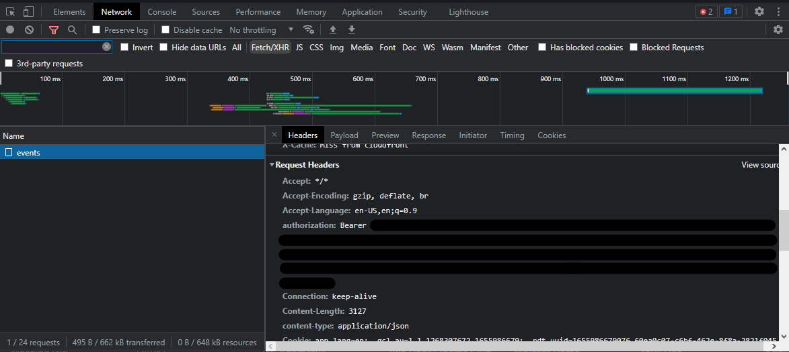

# node-tidal

<div align="left">
  <p>
    <a href="https://github.com/Mawco/node-tidal"></a>
  </p>
  <p>
    <a href="https://nodei.co/npm/node-tidal"></a>
  </p>
</div>

## About

This is a NodeJS wrapper for TIDAL's API with typings.

## Installation

```ts
npm i node-tidal
```

<details>
<summary>How to find your token</summary>

## How to find your token
**!!! TOKEN MAY CHANGE ONCE EVERY FEW DAYS !!!**
1. Go to [listen.tidal.com](https://listen.tidal.com) (make sure you're logged in 😐).
2. Open the devtools and go to network.
3. Click on `Fetch/XHR`.
4. Click any request and look for the `authorization` request header. 
</details>

## Features

- Playlist Management

## Usage/Examples

### Playlist infos

```javascript
const { Tidal } = require('node-tidal');

/* Instantiate a new Tidal object with your Tidal token. */
const tidal = new Tidal({ token: 'token >:(', countryCode: 'EN' });

async function playlistExample() {
  // It's getting the playlist infos of the playlist with the uuid
  // `f4cf62d9-7920-42ca-a2ac-409cf2b1df5b`.
  const playlistInfos = await tidal.playlists.getPlaylistInfos('f4cf62d9-7920-42ca-a2ac-409cf2b1df5b');

  // OUTPUT:
  //{
  //    uuid: 'f4cf62d9-7920-42ca-a2ac-409cf2b1df5b',
  //    title: 'blablablbla',
  //    numberOfTracks: 0,
  //    numberOfVideos: 0,
  //    creator: { id: 188019021 },
  //    description: ':):):):):):):):):):)',
  //    duration: 0,
  //    lastUpdated: '2022-07-14T10:29:14.004+0000',
  //    created: '2022-07-14T10:29:14.004+0000',
  //    type: 'USER',
  //    publicPlaylist: false,
  //    url: 'http://www.tidal.com/playlist/f4cf62d9-7920-42ca-a2ac-409cf2b1df5b',
  //    image: 'e59903d7-94a7-454c-8a78-6a6586967dda',
  //    popularity: 0,
  //    squareImage: 'e9448a9a-3ade-4f79-93d2-12e6d8d4b2eb',
  //    promotedArtists: [],
  //    lastItemAddedAt: null
  //}

  // It's getting the playlist songs of the playlist with the uuid
  // `f4cf62d9-7920-42ca-a2ac-409cf2b1df5b`.
  const playlistSongs = await tidal.playlists.getPlaylistSongs('f4cf62d9-7920-42ca-a2ac-409cf2b1df5b');

  // OUTPUT:
  //   {
  //    "limit":1,
  //    "offset":0,
  //    "totalNumberOfItems":1,
  //    "items":[
  //       {
  //          "item":[
  //             {
  //                "id":211580117,
  //                "title":"Sacrifice",
  //                "duration":189,
  //                "replayGain":-9.79,
  //                "peak":0.999952,
  //                "allowStreaming":true,
  //                "streamReady":true,
  //                "streamStartDate":"2022-01-07T06:00:00.000+0000",
  //                "premiumStreamingOnly":false,
  //                "trackNumber":5,
  //                "volumeNumber":1,
  //                "version":null,
  //                "popularity":41,
  //                "copyright":"℗ 2022 The Weeknd XO, Inc., marketed by Republic Records, a division of UMG Recordings, Inc.",
  //                "description":null,
  //                "url":"http://www.tidal.com/track/211580117",
  //                "isrc":"USUG12106685",
  //                "editable":false,
  //                "explicit":true,
  //                "audioQuality":"HI_RES",
  //                "audioModes":[
  //                   "STEREO"
  //                ],
  //                "artist":{
  //                   "id":4761957,
  //                   "name":"The Weeknd",
  //                   "type":"MAIN",
  //                   "picture":"6ece5525-f380-4d9b-ac79-faf653ceb611"
  //                },
  //                "artists":[
  //                   {
  //                      "id":4761957,
  //                      "name":"The Weeknd",
  //                      "type":"MAIN",
  //                      "picture":"6ece5525-f380-4d9b-ac79-faf653ceb611"
  //                   }
  //                ],
  //                "album":{
  //                   "id":211580112,
  //                   "title":"Dawn FM",
  //                   "cover":"9230a0ef-cf06-454e-8d44-04d181aaa39d",
  //                   "vibrantColor":"#3c798e",
  //                   "videoCover":null,
  //                   "releaseDate":"2022-01-07"
  //                },
  //                "mixes":{
  //                   "MASTER_TRACK_MIX":"0141d776b5bc410a00c48c1f25734e",
  //                   "TRACK_MIX":"0011e6d27cdc7cac683bd1cc5f3b7c"
  //                },
  //                "dateAdded":"2022-07-19T15:16:37.326+0000",
  //                "index":100000,
  //                "itemUuid":"d2b1e7fe-3a50-467e-a860-1edc319d16f0"
  //             }
  //          ],
  //          "type":"track",
  //          "cut":null
  //       }
  //    ]
  // }

  // It's adding the song with the id `43746407` to the playlist with the uuid
  // `f4cf62d9-7920-42ca-a2ac-409cf2b1df5b`.
  const addSong = await tidal.playlists.addSong('f4cf62d9-7920-42ca-a2ac-409cf2b1df5b', '43746407');

  // OUTPUT:
  // { lastUpdated: 1658257738994, addedItemIds: [ 43746407 ] }
}

playlistExample();
```

## Common Types

<details>
<summary>ClientTypes</summary>

```ts
export type Country =
  | 'FR'
  | 'BE'
  | 'EN'
  | 'BG'
  | 'DE'
  | 'DK'
  | 'ES'
  | 'HR'
  | 'IT'
  | 'NO'
  | 'PL'
  | 'PT'
  | 'SE'
  | 'SL'
  | 'SR'
  | 'TR';

export type Methods = 'GET' | 'POST' | 'DELETE' | 'PUT' | 'PATCH';

export interface tidal {
  token: string;
  countryCode?: Country;
  debug?: boolean;
}

export interface RequestOptions {
  headers?: Record<string, string>;
  method?: Methods;
  params?: Record<string, any>;
  body?: Record<string, string | boolean | number | URLSearchParams | (string | boolean | number)[]>;
}
```

</details>

<details>
<summary>PlaylistTypes</summary>

```ts
export type OrderTypes = 'INDEX' | 'NAME' | 'ARTIST' | 'ALBUM' | 'DATE' | 'LENGTH';
export type OrderDirections = 'ASC' | 'DESC';
export type OnDupes = 'FAIL' | 'ADD';

export interface TidalPlaylist {
  uuid: string;
  title: string;
  numberOfTracks: number;
  numberOfVideos: number;
  creator: { id: number };
  description: string;
  duration: number;
  lastUpdated: string;
  created: string;
  type: string;
  publicPlaylist: boolean;
  url: string;
  image: string;
  popularity: number;
  squareImage: string;
  promotedArtists: string[];
  lastItemAddedAt: string;
}

export interface Artist {
  id: number;
  name: string;
  type: string;
  picture: string;
}

export interface Track {
  id: number;
  title: string;
  duration: number;
  replayGain: number;
  peak: number;
  allowStreaming: boolean;
  streamReady: boolean;
  streamStartDate: string;
  premiumStreamingOnly: boolean;
  trackNumber: number;
  volumeNumber: number;
  version: string | number | null;
  popularity: number;
  copyright: string;
  description: string | number | null;
  url: string;
  isrc: string;
  editable: boolean;
  explicit: boolean;
  audioQuality: string;
  audioModes: string[];
  artist: {
    id: number;
    name: string;
    type: string;
    picture: string;
  };
  artists: [Artist[]];
  album: {
    id: number;
    title: string;
    cover: string;
    vibrantColor: string;
    videoCover: string | number | null;
    releaseDate: string;
  };
  mixes: {
    MASTER_TRACK_MIX: string;
    TRACK_MIX: string;
  };
  dateAdded: string;
  index: number;
  itemUuid: string;
}

export interface TidalTrack {
  limit: number;
  offset: number;
  totalNumberOfItems: number;
  items: [{ item: Track; type: string; cut: string | number | null }];
}

export interface AddedTrack {
  lastUpdated: number;
  addedItemIds: number[];
}
```

</details>

## License

[MIT](https://github.com/Mawco/node-tidal/blob/master/LICENSE)
